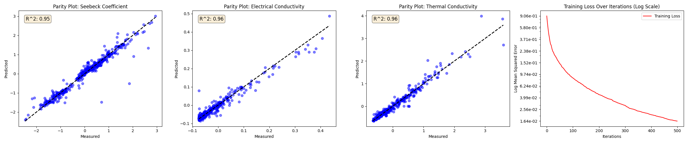
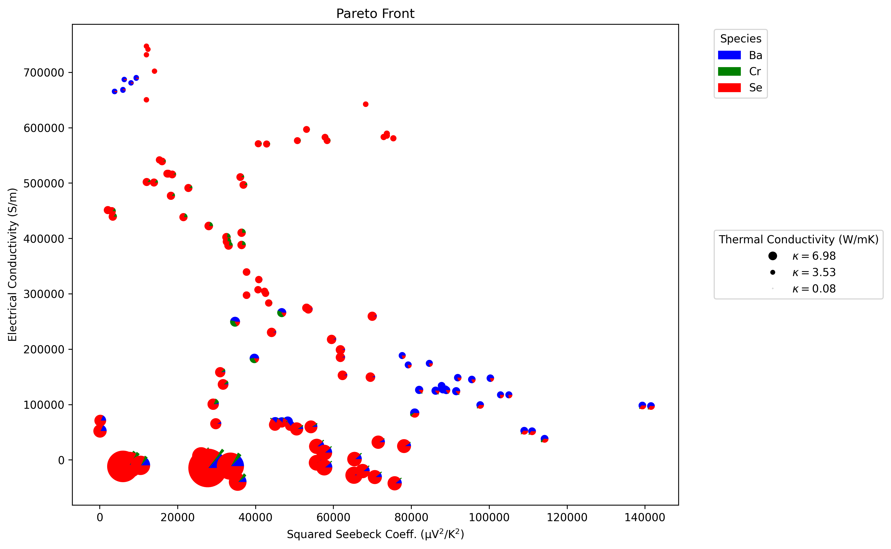

# Hackathon MOBO 2024

  
  

## Dataset
*A Public Database of Thermoelectric Materials and System-Identified Material Representation for Data-Driven Discovery*

<https://github.com/KRICT-DATA/SIMD/tree/main>

## Background

Thermal electrics use a figure-of-merit $zT = \frac{\sigma S^2 T}{\kappa}$. From a materials design perspective, the goal is to find materials with very large electrical conductivity and low thermal conductivity, while also having large (i.e., maximal) Seebeck coefficients, all at a given temperature. This translates to finding the optimal composition of a material.

Multi-Objective Bayesian Optimization (MOBO) can be a powerful tool in this context. Here, the goal is to identify a set of material compositions that achieve the best possible balance between the three key properties. The goal is to capture this via the Pareto front.

**Pareto optimization:** In MOBO for thermoelectrics, we aim to identify a set of material compositions that form the Pareto front. These compositions represent optimal trade-offs between maximizing electrical conductivity and Seebeck coefficient while minimizing thermal conductivity. No single composition on this front can be improved in one property without sacrificing another. 

## Approach

1. Using thermoelectric [dataset](https://github.com/KRICT-DATA/SIMD/tree/main) featurize using compositions via matminer.
2. Train a [Gradient Boosting Regession model](https://scikit-learn.org/stable/auto_examples/ensemble/plot_gradient_boosting_regression.html) to make multi-output prediction for Seebeck coefficient, Electrical Conductivity, and Thermal Conductivity
3. Test function focuses on `Ba`-`Cr`-`Se` compositions as inputs along with temperature and returns the predicted target objectives.

## Steps
1. Run `python model.py`.
2. Use [multi_objective_bo.py](../multi_objective_bo.py) with [testfunc.py](testfunc.py)
3. Plot hypervolume metrics and Pareto front.

## Requirements

- `matminer`
- `scikit-learn`
- `joblib`
- `pandas`
- `matplotlib`
- `deap`

## Appendix
### Default Gradient Boosting model

### Pareto Front using Evolutionary MOO
See [run_moo.py](run_moo.py) for details of implementation. This is only for comparison to MOBO Dragonfly solutions.

